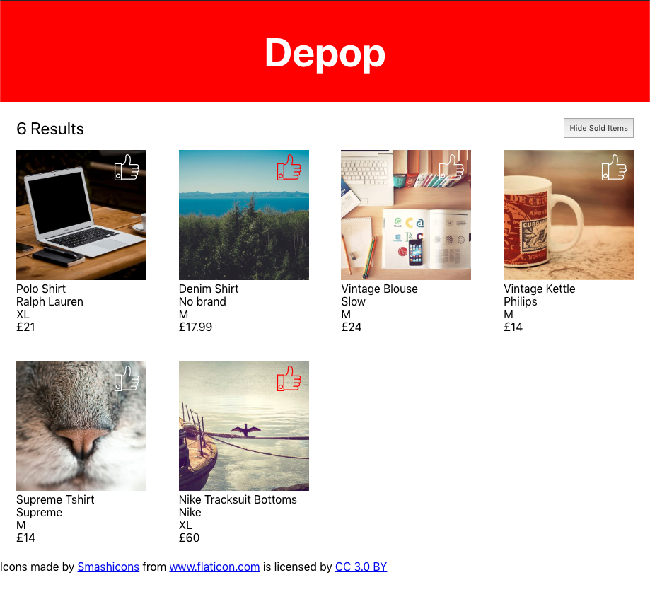

# Depop

This is a tech test. The specification can be found in [docs/SPEC.md](docs/SPEC.md).

This project was bootstrapped with [Create React App](https://github.com/facebook/create-react-app).

## Overview

I implemented my solution over several sessions as time permitted. I would estimate that after 2 hours I had the products loaded with all attributes from the API and displayed in a flex grid with dummy buttons. I then proceeded to fully implement the like buttons and 'Hide Sold Items' button. Finally, I added tests to make sure that functionality would not regress and completed the documentation.

I find it tricky to test react components in a test driven fashion so I got them working first and then added tests. I used the react-test-library framework as I prefer it to enzyme.

I separated the UI elements into separate react components in separate files.

I used a manual jest mock to mock the API response whilst testing. This means that the tests do not rely on the actual API endpoint and the response is fixed with known data.

The like button uses a 'thumbs-up' SVG image. I prefer to use SVG where possible because the image is infinitely scalable without losing detail, the file size is small and can be embedded within the source code instead of being a separate file to be downloaded for increased performance, and it can be manipulated easily in CSS.

## Setup

To get the project code, please enter the following command in the terminal:

```
git clone git@github.com:jonurry/depop.git
```

then, change to the newly created code directory:

```
cd depop
```

To install the project dependencies:

```
npm install
```

To run the app in development mode:

```
npm start
```

To launch the test runner in interactive watch mode:

```
npm test
```

To build the app for production:

```
npm run build
```
